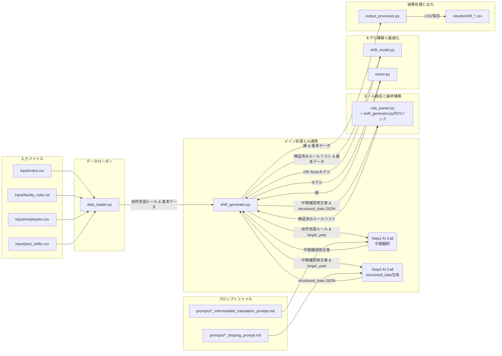

# アプリケーションアーキテクチャ概要

このドキュメントは、シフト生成アプリケーションの主要なPythonモジュールとその役割、データの流れを概説します。

## モジュール構成 (`src/` ディレクトリ内)

1.  **`constants.py`**
    *   **役割:** アプリケーション全体で使用される定数を定義します。
    *   **主な内容:** 入力/出力ファイルのパス, AIプロンプトファイルパス, AIモデル名, シフト期間設定, シフト記号マッピング, 人員配置基準, 制約デフォルト値など。
    *   **依存関係:** 他の多くのモジュールからインポートされます。

2.  **`utils.py`**
    *   **役割:** プロジェクト全体で再利用可能な汎用ユーティリティ関数を提供します。
    *   **主な内容:** 日付範囲生成, 祝日リスト取得, 従業員情報アクセス補助など。
    *   **依存関係:** 複数モジュールから利用されます。

3.  **`data_loader.py`**
    *   **役割:** 外部データソース（CSV, TXTファイル）から基本データ（従業員情報、過去シフト、自然言語ルール）を読み込みます。
    *   **主な内容:** `load_employee_data`, `load_past_shifts`, `load_natural_language_rules`, `load_facility_rules`。
    *   **依存関係:** `constants.py` を利用。`shift_generator.py` から呼び出されます。

4.  **`rule_parser.py`**
    *   **役割:** **AIによって生成された構造化データ (`structured_data`)** を入力とし、その内容を検証し、必要に応じて変換（日付オブジェクト化など）を行います。**個人ルールの祝日展開ロジックもここに（あるいは`shift_generator.py`内に）実装されています。**
    *   **主な内容:** `validate_and_transform_rule`, `validate_facility_rule`。
    *   **依存関係:** `constants.py` を利用。`shift_generator.py` 内の最終ルールリスト構築処理から呼び出されます。

5.  **`shift_model.py`**
    *   **役割:** OR-Tools CP-SATモデルの構築、**最終的に検証・構築された構造化ルールデータ**と基本データに基づいて制約と目的関数をモデルに追加します。
    *   **主な内容:** `build_shift_model` 関数。
    *   **依存関係:** `constants.py`, `utils.py` を利用。`shift_generator.py` から呼び出されます。

6.  **`solver.py`**
    *   **役割:** 構築されたOR-Toolsモデルを入力とし、ソルバーを実行して解を求めます。
    *   **主な内容:** `solve_shift_model` 関数。
    *   **依存関係:** `shift_generator.py` から呼び出されます。

7.  **`output_processor.py`**
    *   **役割:** ソルバーの解を入力とし、最終的なシフト表を指定フォーマットのDataFrameに整形し、CSVファイルとして保存します。
    *   **主な内容:** `create_shift_dataframe`, `process_solver_results`, `save_shift_to_csv`。
    *   **依存関係:** `constants.py`, `utils.py` を利用。`shift_generator.py` から呼び出されます。

## 主要スクリプト (`shift_generator.py`)

*   **役割:** アプリケーション全体の処理フローを制御するメインスクリプト。
    *   データ読み込み (`data_loader.py`) の呼び出し。
    *   **AIによるルール解釈の2ステップ処理の実行:**
        *   ステップ1: 自然言語ルール → 中間確認用文章 (`call_ai_to_translate_...` 関数と対応プロンプト使用)。
        *   ステップ2: 中間確認用文章 → 構造化データ (`structured_data`) JSON (`call_ai_to_generate_...` 関数と対応プロンプト使用)。
    *   AI応答のクリーニングとパース。
    *   中間確認用文章と構造化データを結合し、**`rule_parser.py` の検証関数を呼び出して最終的なルールリストを構築**。
    *   OR-Toolsモデル構築 (`shift_model.py`) の呼び出し。
    *   ソルバー実行 (`solver.py`) の呼び出し。
    *   結果処理と出力 (`output_processor.py`) の呼び出し。
*   **依存関係:** 上記 `src/` 内の全モジュールを利用します。

## データフロー（現在: 2ステップAIアプローチ版）

(※上記フローは簡略化したもので、実際のデータの受け渡しは関数呼び出し経由です。) 